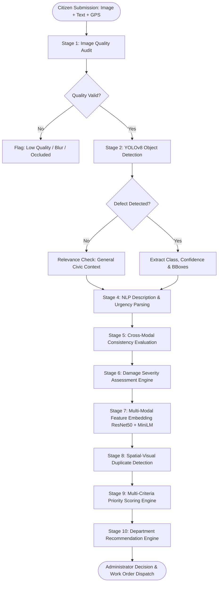

# AI Decision-Support Pipeline Architecture

## Pipeline Overview

The system executes a **10-stage sequential and multi-modal AI decision-support pipeline** on every citizen complaint. The pipeline operates under the principle of **human-in-the-loop oversight**: AI results assist, recommend, and prioritize, but municipal administrators retain full authority to override decisions.

---

## Stage Specifications

### Stage 1: Image Quality Audit
- **Algorithm**:
  - Blur Detection: Variance of the Laplacian ($\sigma^2_{Lap} \ge 100.0$).
  - Brightness Audit: Mean pixel intensity in grayscale ($40 \le \mu_I \le 225$).
  - Contrast Analysis: Pixel standard deviation ($\sigma_I \ge 25.0$).
- **Output**: Quality Score $[0, 100]$, boolean validity flag, and defect list (`BLURRY`, `TOO_DARK`, `TOO_BRIGHT`, `LOW_CONTRAST`).

### Stage 2: YOLOv8 Defect Detection
- **Model**: Fine-tuned Ultralytics YOLOv8s architecture.
- **Classes**:
  1. `pothole`
  2. `garbage`
  3. `streetlight`
  4. `water_leakage`
  5. `damaged_road`
  6. `open_manhole`
  7. `fallen_tree`
- **Output**: Array of detections containing bounding boxes `[x1, y1, x2, y2]`, confidence score $c \in [0.0, 1.0]$, and primary class label.

### Stage 3: Civic Relevance Verification
- Verifies that the detected object belongs to municipal jurisdiction.
- Filters out non-civic imagery (e.g., indoor rooms, selfies, pets, personal vehicles with no road defects).

### Stage 4: NLP Description Parsing
- **Algorithm**: Rule-based keyword matching with lemmatization and urgency marker detection.
- **Urgency Markers**: Flags life-safety terms such as `"accident"`, `"danger"`, `"hazard"`, `"electrocution"`, `"flood"`, `"collapse"`.

### Stage 5: Cross-Modal Consistency Evaluation
- Matches citizen-selected category against YOLO detections and NLP extracted keywords.
- Computes Consistency Score:
  $$S_{consistency} = 0.6 \cdot \mathbb{I}_{vision=category} + 0.4 \cdot \mathbb{I}_{text=category}$$

### Stage 6: Damage Severity Assessment
- Estimates physical damage magnitude and danger levels:
  - **Bounding Box Relative Area**: Normalized area covered by defect on roadway.
  - **Safety Hazard Score**: Category base hazard (e.g., open manhole = 95, unlit streetlight = 70).
  - **Infrastructure Impact**: Potential structural failure progression.
  - **Public Impact**: Footfall or traffic disruption estimate.
- **Output**: Severity Score $[0, 100]$ and Level (`LOW`, `MEDIUM`, `HIGH`, `CRITICAL`).

### Stage 7 & 8: Spatial-Visual Duplicate Detection
- Compares new complaint against existing active complaints within a $500\text{ m}$ radius.
- **Combined Duplicate Distance**:
  $$S_{duplicate} = w_s \cdot S_{spatial} + w_v \cdot S_{visual} + w_t \cdot S_{text} + w_c \cdot S_{category}$$
  - $S_{spatial} = 1 - \frac{\text{Haversine}(lat_1, lon_1, lat_2, lon_2)}{R_{max}}$
  - $S_{visual} = \frac{\mathbf{e}_{v1} \cdot \mathbf{e}_{v2}}{\|\mathbf{e}_{v1}\| \|\mathbf{e}_{v2}\|}$ (ResNet50 Cosine Similarity)
  - $S_{text} = \frac{\mathbf{e}_{t1} \cdot \mathbf{e}_{t2}}{\|\mathbf{e}_{t1}\| \|\mathbf{e}_{t2}\|}$ (MiniLM Cosine Similarity)
- **Status Classification**:
  - `NEW`: $S_{duplicate} < 0.60$
  - `POSSIBLE_DUPLICATE`: $0.60 \le S_{duplicate} < 0.82$
  - `LIKELY_DUPLICATE`: $S_{duplicate} \ge 0.82$

### Stage 9: Multi-Criteria Priority Scoring
- Formulates an operational priority score based on multi-attribute utility theory:
  $$\text{Priority Score} = w_{sev} S_{sev} + w_{haz} S_{haz} + w_{infra} S_{infra} + w_{pub} S_{pub} + w_{freq} S_{freq} + w_{loc} S_{loc} + \Delta_{escalate}$$
- **Thresholds**:
  - `URGENT`: $\text{Score} \ge 80$
  - `HIGH`: $60 \le \text{Score} < 80$
  - `MEDIUM`: $40 \le \text{Score} < 60$
  - `LOW`: $\text{Score} < 40$

### Stage 10: Department Recommendation
- Routes complaint to responsible agency based on verified defect category:
  - `Roads & Highway Authority`: Potholes, damaged roads, subsidence.
  - `Solid Waste Management`: Garbage overflow, illegal dumping.
  - `Electrical & Lighting Dept`: Streetlight failure, exposed wiring.
  - `Water Supply & Sewerage Board`: Pipeline bursts, open manholes, sewer overflow.
- **Confidence Scoring**: Confidence based on detection certainty and consistency agreement.
