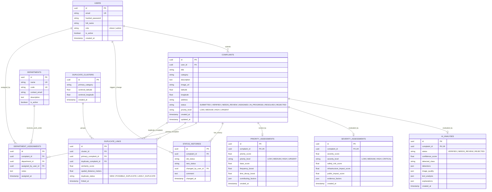

# Database Entity-Relationship (ER) Architecture

## Overview

The database uses a normalized relational architecture designed in PostgreSQL (with SQLite compatibility for local test isolation). Foreign key relationships maintain referential integrity, while cascading rules ensure consistent audit records across all complaints and automated AI analytical records.

---

## Schema Highlights & Indexes

1. **High-Performance Query Indexing**:
   - `complaints (user_id)`: Accelerates citizen portal personal complaint queries.
   - `complaints (status, priority_level)`: Optimizes admin dashboard filtering and sorting.
   - `complaints (latitude, longitude)`: Spatial indexing for radius candidate search.
2. **Auditability**:
   - Every status transition from creation to closure writes an immutable record to `status_histories`.
3. **Multi-Modal Evidence JSON**:
   - `ai_analyses.detections` preserves complete YOLO bounding box arrays `[x1, y1, x2, y2, confidence, class]`, ensuring forensic verifiability.
