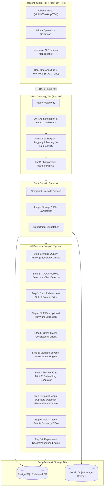

# System Architecture

## Overview

The **AI-Powered Civic Infrastructure Complaint Verification and Prioritization System Using Computer Vision** is structured as an enterprise-grade multi-tier client-server application. It decouples the citizen-facing interaction layer from heavy computer vision and natural language processing pipelines using asynchronous worker patterns, standard RESTful APIs, and relational persistence.

---

## Component Descriptions

### 1. Presentation Tier (React 19 + Vite + TailwindCSS v4)
- **Citizen Portal**: Provides responsive, accessible interfaces for submitting complaints with photo uploads, reverse geocoding, location pinning, and live lifecycle tracking.
- **Admin Operations Console**: High-density operational dashboard featuring:
  - KPI Stat Cards with animated SVG sparkline waves.
  - Interactive Incident Map with priority-colored pins and popup summaries.
  - Detailed Evidence Inspector rendering YOLO bounding box overlays and feature explainability breakdowns.
  - Department routing and workflow status transitions (`SUBMITTED` $\rightarrow$ `VERIFIED` $\rightarrow$ `ASSIGNED` $\rightarrow$ `IN_PROGRESS` $\rightarrow$ `RESOLVED`).

### 2. Application & API Tier (FastAPI)
- **High Concurrency Asynchronous Engine**: Built on Starlette and Pydantic v2 for data contract validation.
- **Security & Authorization**:
  - Stateless JWT authentication with Bearer tokens.
  - Role-Based Access Control (`citizen`, `admin`, `department_head`).
  - Path traversal defense, MIME sniffing verification, and file size quotas (10 MB).
  - Request ID tracing (`X-Request-ID`) and performance duration headers.

### 3. AI Service Pipeline Tier
- Pure Python micro-services implementing modular decision-support interfaces:
  - **Vision Engine**: PyTorch / Ultralytics YOLOv8 detector trained on civic infrastructure defects.
  - **Quality Engine**: OpenCV Laplacian variance (blur), brightness histogram, and contrast analysis.
  - **Similarity Engine**: Multi-modal fusion combining geographic distance (Haversine formula), visual cosine distance (ResNet50 feature maps), and textual semantic distance (Sentence-BERT).
  - **Multi-Criteria Scoring Engine**: Configurable mathematical weighting prioritizing critical safety hazards and high-frequency complaint clusters.

### 4. Persistence Tier (PostgreSQL + SQLAlchemy 2.0)
- Relational schema enforcing referential integrity across users, complaints, AI analytical runs, status audits, and spatial duplicate link tables.
- Supports indexing on `user_id`, `category`, `status`, `priority_level`, and spatial coordinates `(latitude, longitude)`.
